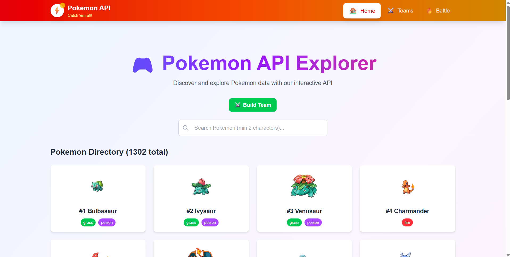
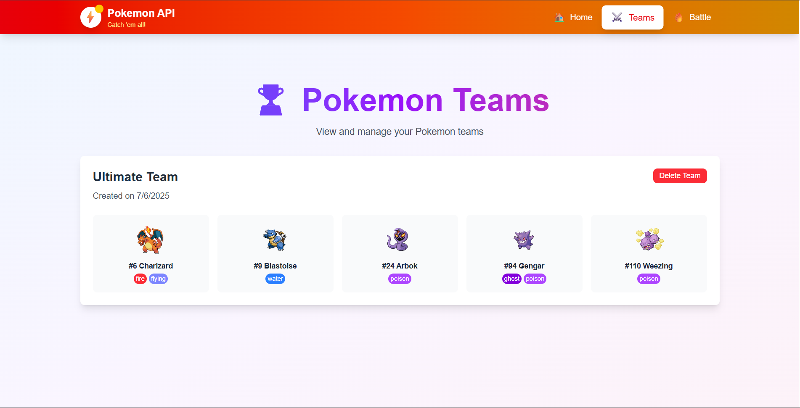
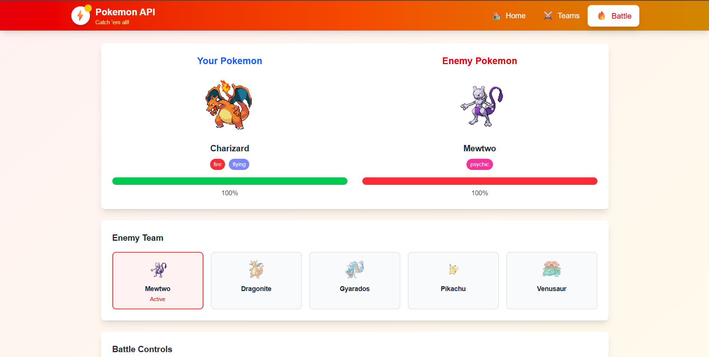
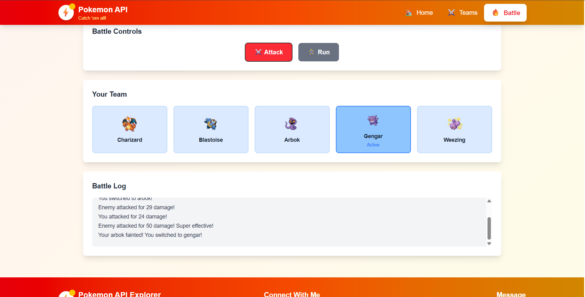
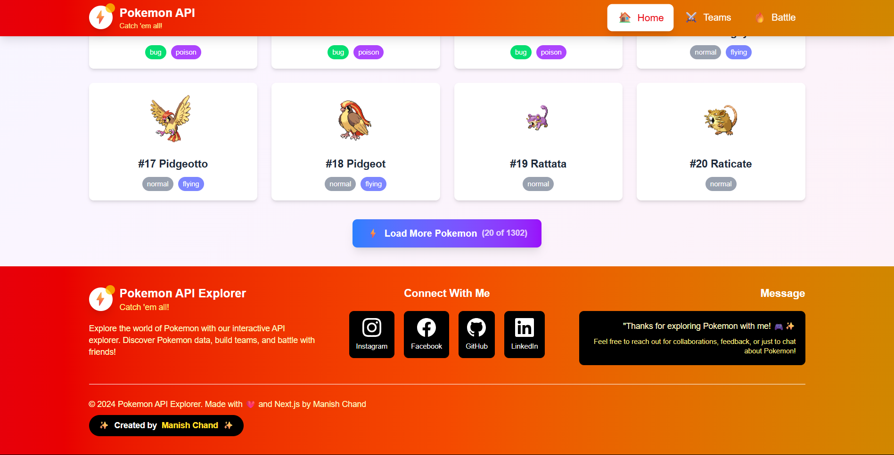

# Pokemon API - Next.js 15

A Next.js 15 API wrapper for the PokeAPI with enhanced features, caching, and search functionality.

## Features

- 🎮 **Pokemon Data**: Fetch Pokemon with detailed information
- 🔍 **Search**: Search Pokemon by name
- 🏷️ **Types**: Get Pokemon types with damage relations
- ⚡ **Abilities**: Fetch Pokemon abilities
- ⚡ **Create Team**: Battle with an Ai
- 📄 **Pagination**: Built-in pagination support
- 🚀 **Caching**: Optimized caching with stale-while-revalidate
- 🛡️ **Error Handling**: Comprehensive error handling and validation
## Images






## API Endpoints

### Get All Pokemon
```
GET /api/pokemon?limit=20&offset=0
```

**Parameters:**
- `limit` (optional): Number of Pokemon to return (default: 20)
- `offset` (optional): Number of Pokemon to skip (default: 0)

**Example:**
```bash
curl http://localhost:3000/api/pokemon?limit=5
```

### Get Specific Pokemon
```
GET /api/pokemon/[id_or_name]
```

**Parameters:**
- `id_or_name`: Pokemon ID or name (e.g., `25`, `pikachu`)

**Examples:**
```bash
curl http://localhost:3000/api/pokemon/25
curl http://localhost:3000/api/pokemon/pikachu
```

### Search Pokemon
```
GET /api/search?q=search_term
```

**Parameters:**
- `q` (required): Search term (minimum 2 characters)

**Example:**
```bash
curl http://localhost:3000/api/search?q=char
```

### Get Pokemon Types
```
GET /api/types
```

**Example:**
```bash
curl http://localhost:3000/api/types
```

### Get Pokemon Abilities
```
GET /api/abilities?limit=20&offset=0
```

**Parameters:**
- `limit` (optional): Number of abilities to return (default: 20)
- `offset` (optional): Number of abilities to skip (default: 0)

**Example:**
```bash
curl http://localhost:3000/api/abilities?limit=10
```

## Response Format

### Pokemon Object
```json
{
  "id": 25,
  "name": "pikachu",
  "height": 4,
  "weight": 60,
  "base_experience": 112,
  "sprites": {
    "front_default": "https://raw.githubusercontent.com/PokeAPI/sprites/master/sprites/pokemon/25.png",
    "front_shiny": "https://raw.githubusercontent.com/PokeAPI/sprites/master/sprites/pokemon/shiny/25.png",
    "back_default": "https://raw.githubusercontent.com/PokeAPI/sprites/master/sprites/pokemon/back/25.png",
    "back_shiny": "https://raw.githubusercontent.com/PokeAPI/sprites/master/sprites/pokemon/back/shiny/25.png"
  },
  "types": [
    {
      "slot": 1,
      "type": {
        "name": "electric",
        "url": "https://pokeapi.co/api/v2/type/13/"
      }
    }
  ],
  "abilities": [
    {
      "ability": {
        "name": "static",
        "url": "https://pokeapi.co/api/v2/ability/9/"
      },
      "is_hidden": false,
      "slot": 1
    }
  ],
  "stats": [
    {
      "base_stat": 35,
      "effort": 0,
      "stat": {
        "name": "hp",
        "url": "https://pokeapi.co/api/v2/stat/1/"
      }
    }
  ]
}
```

## Getting Started

### Prerequisites
- Node.js 18+ 
- npm or yarn

### Installation

1. Clone the repository:
```bash
git clone <repository-url>
cd pokemon-api-project
```

2. Install dependencies:
```bash
npm install
```

3. Run the development server:
```bash
npm run dev
```

4. Open [http://localhost:3000](http://localhost:3000) in your browser

### Production Build

```bash
npm run build
npm start
```

## Technology Stack

- **Framework**: Next.js 15
- **Language**: JavaScript
- **Styling**: Tailwind CSS
- **API**: PokeAPI (https://pokeapi.co/)
- **Caching**: Built-in Next.js caching with stale-while-revalidate

## API Features

### Caching
All endpoints include caching headers for optimal performance:
- `Cache-Control: public, s-maxage=3600, stale-while-revalidate=86400`

### Error Handling
Comprehensive error handling with appropriate HTTP status codes:
- `400`: Bad Request (missing parameters, invalid input)
- `404`: Not Found (Pokemon not found)
- `500`: Internal Server Error

### Validation
- Search queries must be at least 2 characters long
- Pokemon IDs and names are validated
- Pagination parameters are validated and sanitized

## Development

### Project Structure
```
src/
├── app/
│   ├── api/
│   │   ├── pokemon/
│   │   │   ├── route.js          # GET /api/pokemon
│   │   │   └── [id]/
│   │   │       └── route.js      # GET /api/pokemon/[id]
│   │   ├── types/
│   │   │   └── route.js          # GET /api/types
│   │   ├── abilities/
│   │   │   └── route.js          # GET /api/abilities
│   │   └── search/
│   │       └── route.js          # GET /api/search
│   ├── page.js                   # Homepage
│   ├── layout.js                 # Root layout
│   └── globals.css               # Global styles
```

### Adding New Endpoints

To add a new API endpoint:

1. Create a new directory in `src/app/api/`
2. Add a `route.js` file with GET/POST handlers
3. Export the appropriate HTTP methods

Example:
```javascript
// src/app/api/example/route.js
import { NextResponse } from 'next/server';

export async function GET(request) {
  return NextResponse.json({ message: 'Hello World' });
}
```

## License

This project is open source and available under the [MIT License](LICENSE).

## Contributing

1. Fork the repository
2. Create a feature branch
3. Make your changes
4. Add tests if applicable
5. Submit a pull request

## Support

If you encounter any issues or have questions, please open an issue on GitHub.
